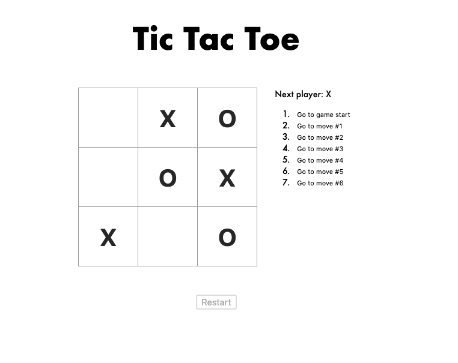

# Tic Tac Toe
Simple tic tac toe game using JS, React, CSS, and HTML5. 

---

## Motivation
#### Review fundamental React principles using the React documentation, which include:
1. Lifting state up 
2. Passing data through props
3. Function components
4. Immutability
  
## Features: 
* Game logic to determine winner and loser
* History buttons that render pieces at given step 
* Restart button to reset game state

